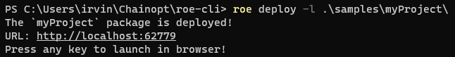
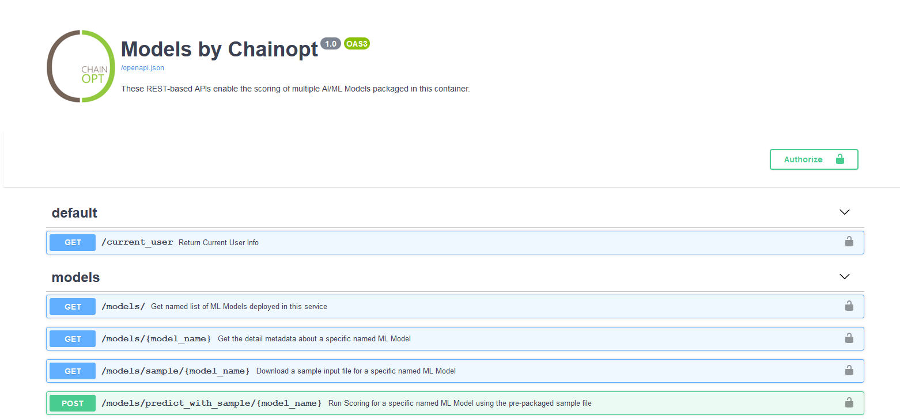

## Deploy

The deploy command allows us to deploy a package folder locally on our machine. To run deploy, simply run the following line:

`roe deploy -l path/to/package/folder`

Additionally, the following parameters can be added to customize your deployment, although they are optional:

* `-l` is for local deployment (only local is available for now).
* `-n` is for specifying a package name. If left out, the folder name is chosen as package name.
* `-p` is a port you specify for it to be spun up on(The valid range is 1024-65535). If left out, a port will be
  assigned.
* `-q` is to deploy with no extra prompts to affirm redeployments and no webpage opening when finishing the deployment.

The expected command-line output is shown below:

When you open the webpage, it should look similar to:

