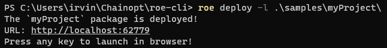
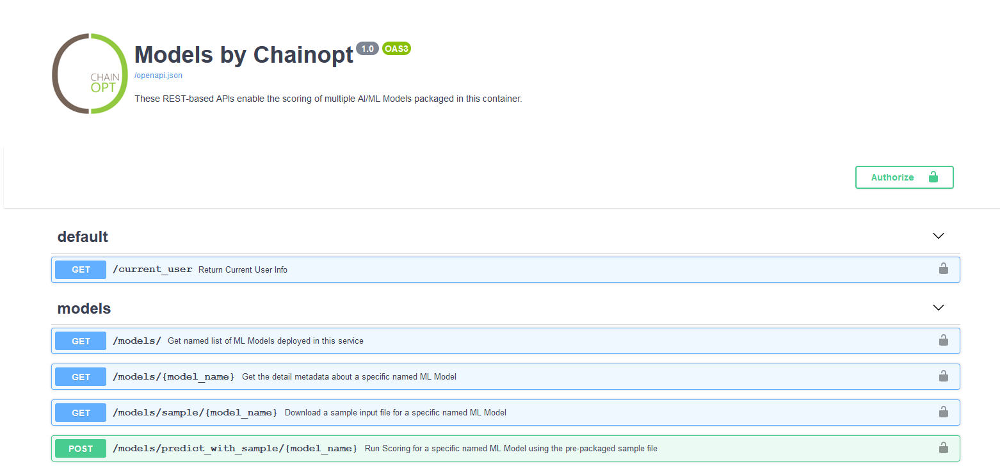

[](https://badge.fury.io/py/roe)
[](https://pypi.python.org/pypi/roe)

Before using, please ensure that [Python](https://www.python.org/downloads/) and [Docker](https://www.docker.com/products/docker-desktop) are installed and running on your machine.


## Quickstart

1. Install roe: `pip install roe`

2. Deploy your package : `roe deploy -l path/to/package/folder`

   eg: `roe deploy -l /Users/abcdef@ghi.com/Documents/git/myProject`

   Note: you will be prompted to enter the provided **docker hub username and password**


----


## Commands:

Click on any of the following commands to see more details, example usage, and expected outputs.


<details>
   
<summary class="summary-header">
Deploy
</summary>

The deploy command allows us to deploy a package folder locally on our machine. To run deploy, simply run the following line:

`roe deploy -l path/to/package`

Additionally, the following parameters can be added to customize your deployment, although they are optional:

* `-l` is for local deployment (only local is available for now).
* `-n` is for specifying a package name. If left out, the folder name is chosen as package name.
* `-p` is a port you specify for it to be spun up on(The valid range is 1024-65535). If left out, a port will be
  assigned.
* `-q` is to deploy with no extra prompts to affirm redeployments and no webpage opening when finishing the deployment.

The expected command-line output is shown below:



When you open the webpage, it should look similar to:


   
#### Re-deploying a package.

`roe deploy -l path/to/package`

**If you used a custom name for your package, you will have to specify it with the package name (-n) flag just like you did initially.**

e.g. `roe deploy -l path/to/UpdatedPackage`

or

`roe deploy -l -n myCustomName path/to/UpdatedPackage`

>Note: It will re-use the port from the first deployment.
  
</details>


<details>
  
<summary class="summary-header">
Help
</summary>
   
At any time, you can see what commands are avaible to you for roe by running

```roe --help```

with an expected output shown below:
   


</details>


<details>
  
<summary class="summary-header">
Begin
</summary>
   
Running any roe command outside of `--help` will begin roe, but if you'd like to start roe without any other functionality, you can run

```roe begin -l```

with an expected output shown below:
   

   
Additionally, you can optionally pass through a YAML file with the credentials in it. The syntax for that is:

`roe begin -l -f path/to/file/docker-creds.yaml`
   
where the YAML file can have any filename, but must be formatted as follows:

```
docker_pw: mypassword
docker_user: myusername
```

</details>


<details>
  
<summary class="summary-header">
End
</summary>
   
You can stop the roe services from running locally on your machine by running

```roe end -l```

with an expected output shown below:
   


If you have any running packages, you will be prompted if you'd like to stop them temporarily (not deleted) and if so, they can be restarted upon starting up roe again.

   
</details>


<details>
  
<summary class="summary-header">
Verify
</summary>
   
Before attempting to deploy a package, it can sometimes be helpful to verify that the package is properly formatted. This is automatically done when running deploy, but can be done seperately by running

```roe verify -l path/to/package/folder```

with an expected output shown below:
   

   
Alternatively, if your package fails verification, you will likely see an output similar to:


   
</details>


<details>

<summary class="summary-header">
Undeploy
</summary>
   
To undeploy any package, you can run:

```roe undeploy -l -p packageName```

The expected output for undeploying a package is shown below:
   

   
Alternatively, if you'd like to undeploy all packages, you can run:

```roe undeploy -l --all```

The expected output for undeploying all packages is shown below:
   


</details>


<details>

<summary class="summary-header">
Logs
</summary>
   
To get the logs for any package, simply run:

```roe logs -l packageName```

The expected output for that command is shown below:
   

   
</details>


<details>
  
<summary class="summary-header">
List
</summary>
   
The list command allows us to see which models are currently deployed by roe. To run list, simply run the following line:

```roe list -l```

with an expected output shown below:
   


</details>


<details>
  
<summary class="summary-header">
Start
</summary>
   
To start a package that's not currently running, you can run

```roe start -l -p packageName```
   
Alternatively, if you'd like to make sure that all stopped packages are running again, you can run:

```roe start -l --all```

Both commands currently run without any feedback, as shown below:
   


</details>


<details>

<summary class="summary-header">
Stop
</summary>
   
To stop any package, you can run:

```roe stop -l -p packageName```
   
Alternatively, if you'd like to stop all packages, you can run:

```roe stop -l --all```

The expected output for stopping a package is shown below:
   


</details>


