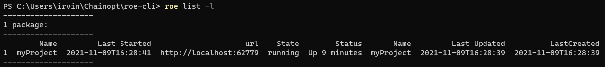

  

    ## List
  

  
  The list command allows us to see which models are currently deployed by roe. To run list, simply run the following line:

  `roe list -l`

  with an expected output shown below:

  
  

